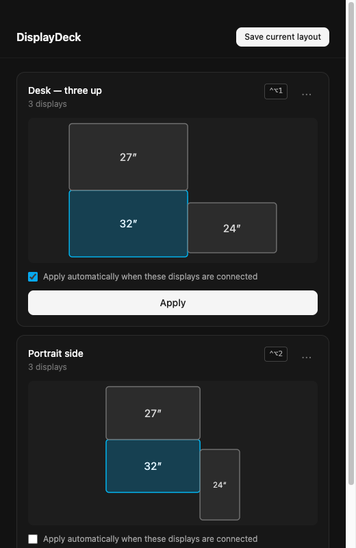

# DisplayDeck

Save your macOS display arrangements and restore them from the menu bar or a
hotkey — instead of dragging boxes around in System Settings several times a day.



## Requirements

- macOS 12 or later (Apple Silicon or Intel)
- [`displayplacer`](https://github.com/jakehilborn/displayplacer), which does the
  actual display manipulation:

```bash
brew install displayplacer
```

DisplayDeck tells you if it's missing and shows you that command, so you can
install it after the fact and reopen the app.

## Install

1. Download `DisplayDeck-1.0.0-arm64.dmg` (Apple Silicon) or
   `DisplayDeck-1.0.0.dmg` (Intel) from the release.
2. Open the DMG and drag **DisplayDeck** to Applications.
3. **First launch only:** right-click the app and choose **Open**, then confirm.

That third step matters. DisplayDeck is ad-hoc signed rather than signed with a
paid Apple Developer ID, so Gatekeeper refuses to open it on a double-click and
says the app "cannot be opened because the developer cannot be verified."
Right-click → Open is the supported way to run it anyway; macOS remembers the
choice and every later launch is a normal double-click.

## Using it

DisplayDeck lives in the menu bar and has no Dock icon.

- **Save a layout** — arrange your displays how you want them, then choose
  *Save current layout* from the menu bar icon or the app window.
- **Restore a layout** — click the menu bar icon and pick a profile. The
  checkmark shows which one you applied last.
- **Hotkeys** — assign a shortcut per profile and it works from anywhere, with
  the window closed. If another app already owns the combination, the profile
  card says so rather than failing silently.
- **Auto-apply** — tick *Apply automatically when these displays are connected*
  and the profile is restored on its own when you dock or undock.

Profiles whose displays aren't all attached are dimmed and name the missing
display instead of offering an apply that would fail.

## Known issues

**Rotating the built-in display can crash SystemUIServer** on some macOS
versions. The menu bar and Dock relaunch on their own after a moment; nothing is
lost. This happens inside macOS's own rotation handling, below anything
DisplayDeck controls. Rotating external displays is unaffected.

**Swapping a monitor invalidates a profile.** Persistent display ids survive
moving a display between ports, but a *different* physical monitor gets a new
id. Profiles referencing the old one will show as not applicable — save a new
profile to replace them.

**Saving while your displays are asleep is refused.** Asleep displays report
themselves as disabled with no geometry, so a profile captured then would
switch every screen off when applied. DisplayDeck refuses to save and tells you
to wake the displays first.

**displayplacer exits successfully even when a screen fails to move**, reporting
the problem on stdout instead. DisplayDeck parses that output, so per-screen
failures surface as errors rather than passing silently.

## Development

```bash
npm install
npm run dev      # electron-vite dev server
npm test         # vitest
npm run lint     # eslint + tsc --noEmit
npm run build    # electron-builder -> DMG in release/
```

### Architecture

The main process owns everything privileged. The renderer is pure UI with
`contextIsolation`, `sandbox`, and no `nodeIntegration` — it reaches main only
through named IPC channels on the preload bridge, and cannot touch `fs` or
`child_process` at all.

Display manipulation is delegated entirely to the `displayplacer` CLI rather
than to CoreGraphics bindings. Saving a profile captures the quoted arguments
from `displayplacer list`; applying one passes them straight back.

| Path | Role |
|---|---|
| `src/main/displayplacer.ts` | Binary resolution, output parsing, capture, apply |
| `src/main/store.ts` | Profile CRUD, atomic JSON writes |
| `src/main/tray.ts` | Menu bar icon and menu |
| `src/main/hotkeys.ts` | Global shortcut registration and conflict tracking |
| `src/main/autoswitch.ts` | Debounced display-change watcher |
| `src/shared/layout.ts` | Preview geometry |

The binary is resolved by absolute path (`/opt/homebrew/bin`, `/usr/local/bin`,
`/usr/bin`) rather than through `PATH`, because an `.app` launched from Finder
inherits no shell environment — a `PATH` lookup works in development and fails
in the packaged build.

## Licence

MIT
