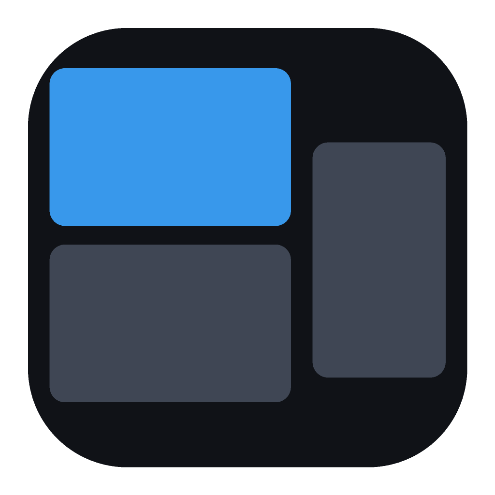
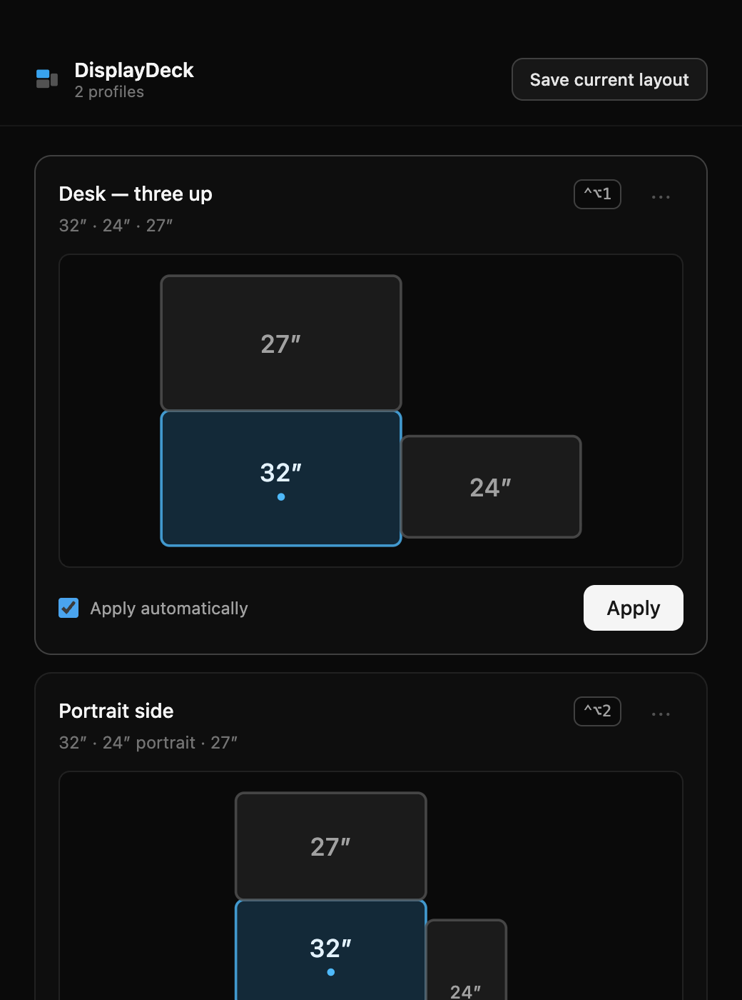
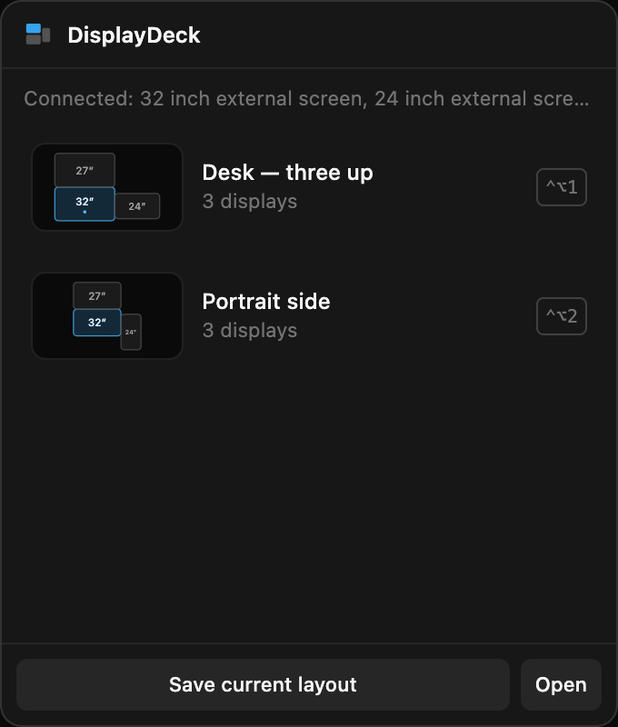
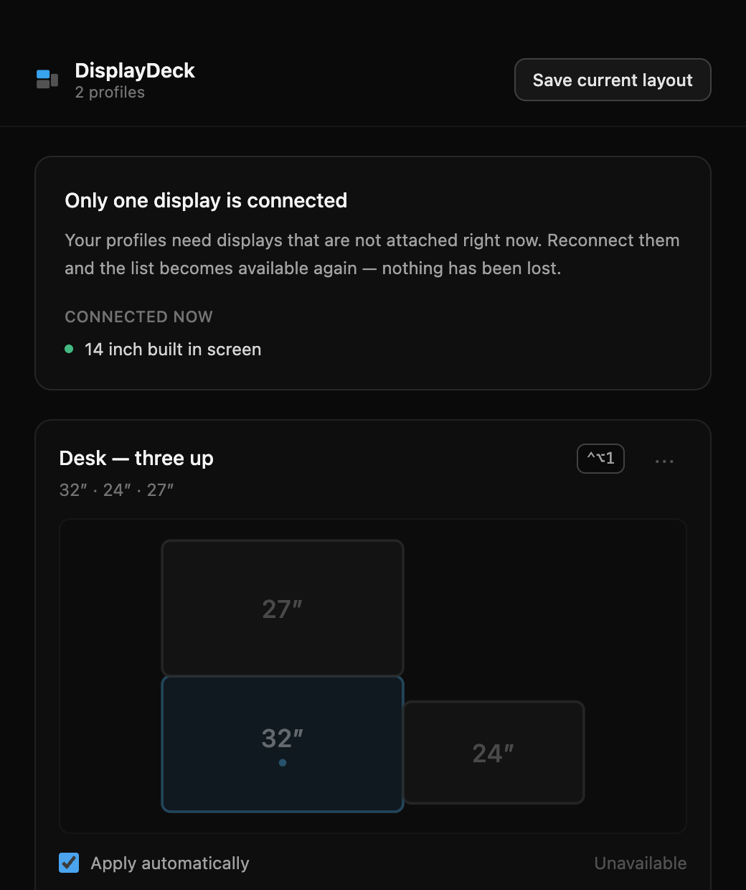
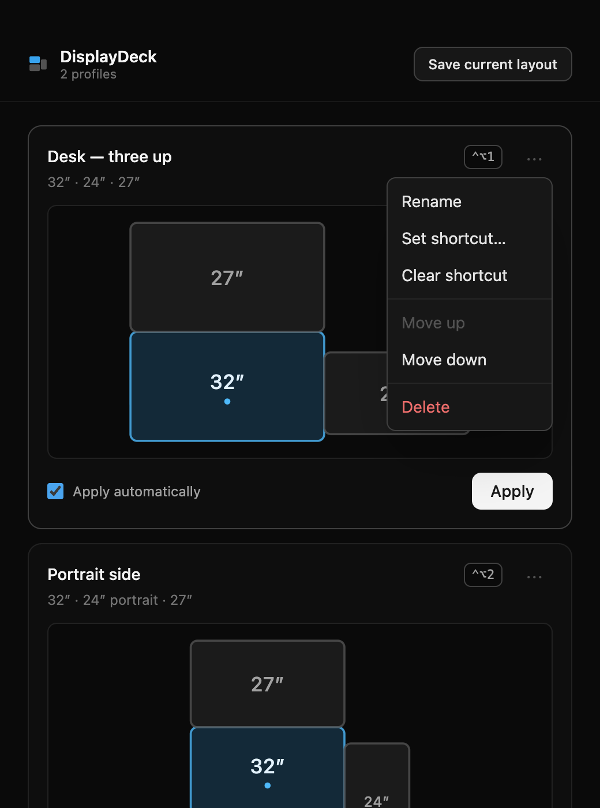

<div align="center">



# DisplayDeck

**Save your macOS display arrangements and restore them from the menu bar or a keyboard shortcut.**


</div>

---

## The problem

If you run several external displays, changing how they're arranged means opening
System Settings → Displays and dragging boxes around. Rotating one monitor between
landscape and portrait, or moving between docked and undocked, turns into a chore
you repeat several times a day.

DisplayDeck saves an arrangement once and restores it in a click, a keystroke, or
automatically when you plug the displays back in.

<div align="center">



</div>

---

## Features

### Named profiles with visual previews

Every saved arrangement is drawn to scale, so you can tell profiles apart at a
glance. Displays stacked above the primary one, displays sitting at negative
coordinates, and displays rotated to portrait are all drawn where they actually
are. The primary display is marked with a dot.

### A menu bar popover, not just a text menu

Click the menu bar icon and you get a picture of every saved layout. Click one to
apply it. Right-click the icon instead for a plain text menu with a checkmark on
whichever profile you applied last.

<div align="center">



</div>

### Global keyboard shortcuts

Assign a combination per profile and it works from anywhere, even with the window
closed. Shortcuts must include a modifier, so a stray binding can't swallow a key
for every app on your Mac. If another app already owns a combination, the profile
says so instead of failing quietly.

### Automatic switching on dock and undock

Mark a profile to apply itself whenever its displays are connected. macOS reports
a single dock event as a burst of notifications, so DisplayDeck waits for them to
settle and applies the matching profile exactly once — including ignoring the
events its own changes provoke.

### It tells you what it can see

Unplug a display and profiles that need it stop offering themselves immediately.
Rather than a cryptic failure, the window explains what's connected and what's
missing — and distinguishes "only your built-in screen" from "no displays
readable at all", which usually just means the screens are asleep.

<div align="center">



</div>

### Rename, reorder, delete

Everything else lives in each profile's `⋯` menu. Ordering carries through to the
menu bar.

<div align="center">



</div>

### Out of the way by default

No Dock icon and no app switcher entry. The menu bar icon is the entire interface
until you ask for more.

---

## Install

### 1. Install displayplacer

DisplayDeck delegates the actual display manipulation to
[`displayplacer`](https://github.com/jakehilborn/displayplacer), so it needs to be
present first:

```bash
brew install displayplacer
```

Skip this and the app will open and show you exactly this command — you can
install it afterwards and reopen.

### 2. Download the disk image

| File | For |
|---|---|
| `DisplayDeck-1.0.0-arm64.dmg` | Apple Silicon (M1 and later) |
| `DisplayDeck-1.0.0.dmg` | Intel |

Not sure which you need: Apple menu → About This Mac. Anything starting with
"Apple M" is Apple Silicon.

Open the disk image and drag **DisplayDeck** to Applications.

### 3. First launch: macOS will block it once

> [!IMPORTANT]
> macOS will say it **cannot verify DisplayDeck is free of malware**. That is
> expected. DisplayDeck is ad-hoc signed rather than notarised with a paid Apple
> Developer ID, and macOS blocks every unnotarised app the first time it runs.

To open it:

1. Double-click **DisplayDeck** once and dismiss the warning.
2. Open **System Settings → Privacy & Security**.
3. Scroll to the Security section. There will be a line reading *"DisplayDeck was
   blocked to protect your Mac"* with an **Open Anyway** button.
4. Click **Open Anyway**, authenticate, then confirm **Open**.

The Open Anyway entry only appears after a blocked launch attempt, so step 1 is
required. macOS remembers the decision — every launch after this is a normal
double-click.

On macOS 14 and earlier you can instead right-click the app and choose **Open**.
That shortcut was removed in macOS 15 (Sequoia), so use the steps above on any
current system.

Prefer the terminal? This does the same thing in one command:

```bash
xattr -dr com.apple.quarantine /Applications/DisplayDeck.app
```

### 4. Save your first layout

Arrange your displays how you want them, click the menu bar icon, and choose
**Save current layout**. That's the whole loop — click that profile any time to
restore it.

---

## Using it

| Task | How |
|---|---|
| Restore a layout | Click the menu bar icon, click a profile |
| Save the current arrangement | Menu bar icon → *Save current layout* |
| Assign a shortcut | Profile's `⋯` menu → *Set shortcut…*, then press the combination |
| Remove a shortcut | Profile's `⋯` menu → *Clear shortcut* |
| Apply automatically on connect | Tick *Apply automatically* on the profile |
| Rename / reorder / delete | Profile's `⋯` menu |
| Open the full window | Menu bar popover → *Open* |
| Quit | Right-click the menu bar icon → *Quit DisplayDeck* |

Profiles are stored as a single JSON file in
`~/Library/Application Support/DisplayDeck/profiles.json`, written atomically so a
crash mid-write can't corrupt it.

---

## Known limitations

**Rotating the built-in display can crash SystemUIServer** on some macOS versions.
The menu bar relaunches itself after a moment and nothing is lost. This happens
inside macOS's own rotation handling, below anything DisplayDeck controls.
Rotating external displays is unaffected.

**Swapping a monitor invalidates a profile.** Display identifiers survive moving a
display between ports, but a *different* physical monitor gets a new identifier.
Affected profiles show as unavailable — save a new one to replace them.

**Window positions are not restored**, only display arrangement. That was
deliberately out of scope.

**No cloud sync, accounts, telemetry, or auto-update.** Your profiles are a file
on your Mac.

---

## Development

```bash
npm install
npm run dev      # electron-vite dev server with hot reload
npm test         # vitest — 94 unit tests
npm run lint     # eslint + tsc --noEmit
npm run build    # both DMGs into release/
```

### Stack

| | |
|---|---|
| Shell | Electron 44 |
| Build | electron-vite 5, Vite 7 |
| Interface | React 18, TypeScript 6 (strict), Tailwind CSS 4 |
| Tests | Vitest 4 |
| Packaging | electron-builder 26 |
| Engine | `displayplacer` 1.4.0 |

### How it works

Display manipulation is delegated entirely to the `displayplacer` CLI rather than
to CoreGraphics bindings. `displayplacer list` ends its output with a ready-to-run
command reproducing the current arrangement; saving a profile captures those
arguments, and applying one passes them straight back. That is the whole engine.

All privileged work lives in the main process. The renderer runs with
`contextIsolation`, `sandbox`, and no `nodeIntegration` — it cannot reach the
filesystem or spawn processes, and communicates only through named IPC channels
declared on the preload bridge.

```
src/
  main/          displayplacer.ts, store.ts, tray.ts, hotkeys.ts,
                 autoswitch.ts, ipc.ts, index.ts
  preload/       contextBridge surface
  renderer/      React interface
  shared/        types and layout maths used by both sides
```

### Notes for contributors

Two macOS quirks are worth knowing before you touch the build:

- **The binary is resolved by absolute path** (`/opt/homebrew/bin`,
  `/usr/local/bin`, `/usr/bin`), never through `PATH`. An `.app` launched from
  Finder inherits no shell environment, so a `PATH` lookup works in development
  and fails in the packaged build.
- **`npm run build` stages the app outside the project tree.** macOS stamps
  metadata onto `.app` bundles living inside the project directory that makes
  `codesign` refuse to sign them. Only the finished disk images are copied back
  into `release/`.

---

## Licence

MIT. Requires [displayplacer](https://github.com/jakehilborn/displayplacer) by
Jake Hilborn, which is MIT licensed and installed separately.
